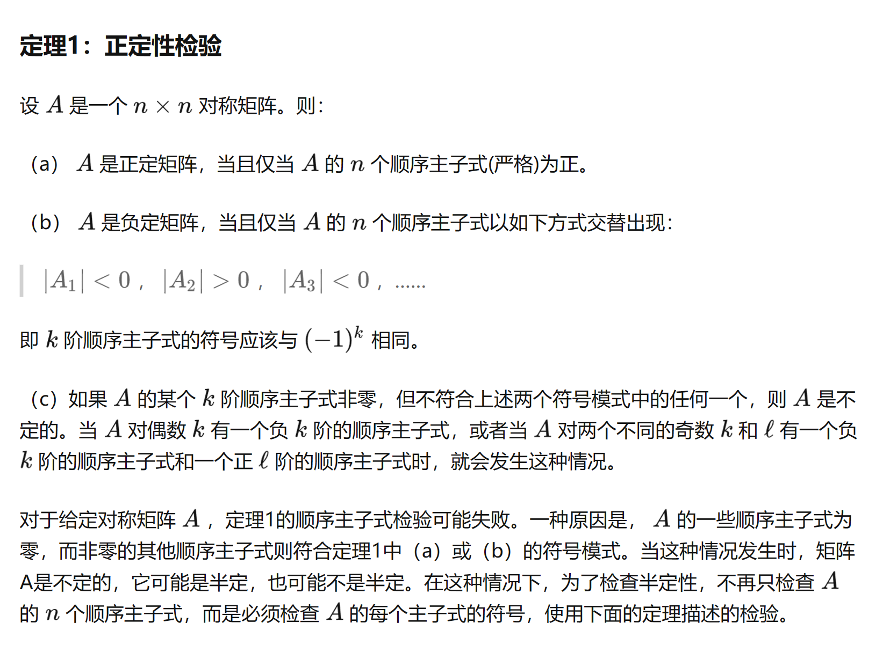
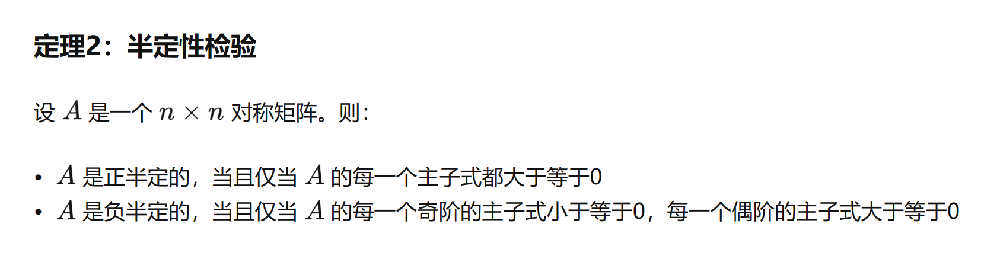

# HW1

## 1

$
(a) Yes.\ D\
 is\ compact.\\
(b) minimum: f(0, 0 ,0) = 2\\
    maximum\ does\ not\ exist.
$

## 2

(a) $Yes$
$$\mid\mid x\mid\mid\rightarrow\infty$$
$$\quad f(x) \geq  \frac{1}{2}(x_1-3)^2 + \frac{3}{2}(x_2-\frac{5}{3})^2 - \frac{9}{2} - \frac{25}{6} \rightarrow\infty$$

(b) minimum: $f(1, 1) = -4$
$$
\nabla f(x) =
\begin{bmatrix}
    2x_1 + x_2 - 3 \\
    4x_2 + x_1 - 5
\end{bmatrix}=
\begin{bmatrix}
    0 \\
    0
\end{bmatrix}\Rightarrow x = \begin{bmatrix}
    1 \\
    1
\end{bmatrix}
$$
maximum does not exist.

## 3

$$
\left | \begin{matrix}
    1& \alpha \\
    \alpha& 4 \\
\end{matrix} \right | > 0
$$
$$
\left | \begin{matrix}
    1& \alpha & -1\\
    \alpha& 4 & 2\\
    -1& 2 & 4\\
\end{matrix} \right | > 0
$$

$\alpha \in (-2, 2)$

## 4

(a) positive definite

```python
x = np.array([[7, 2, 0], [2, 4, 1], [0, 1, 3]])
print(np.linalg.eigvals(x))
>>> [8.04096459 3.87053872 2.08849669]
```

(b) indefinite
$\lambda_1 = -2, \lambda_2 = 3, \lambda_3 = 4$

(c) C is negative definite
D is indefinite

Validation:

```python
C = np.array([[-5, 2, 2], [2, -6, 0], [2, 0, -4]])
print(np.linalg.eigvals(C))
>>> [-2. -8. -5.]

D = np.array([[-1, 1, -2], [1, -1, 1], [-2, 1, 1]])
print(np.linalg.eigvals(D))
>>> [-3.13263749 -0.14043537  2.27307286]
```



